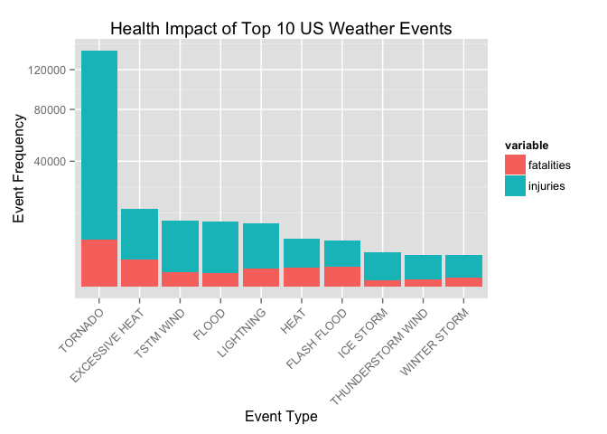
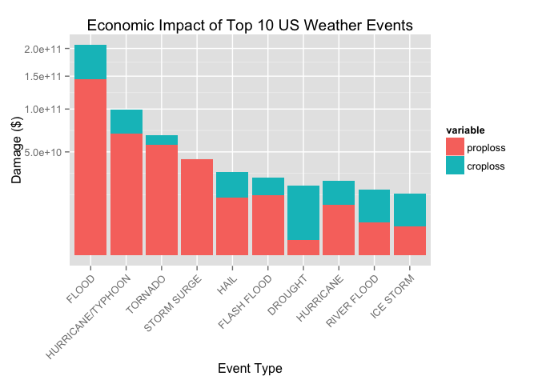

# Reproducible Research: Peer Assessment 2

## Exploring the NOAA Storm Database: Analyzing the impact of severe weather events on population health and the economy from 1950 to 2011.

## Synopsis
Storms and other severe weather events can cause both public health and economic problems for communities and local government institutions. Those severe events can result in fatalities, injuries, property and other damages to the economy. Being able estimate the impact of those events is a major area of focus to define public policy and investments in prevention.

This analysis will focus on finding answer to two major questions:

1. Which types of events are most harmful with respect to population health
2. Which types of events have the greatest economic consequences

across the United States.

This project uses the U.S. National Oceanic and Atmospheric Administration's (NOAA) storm database that recorded events from the year 1950 until November 2011. This database tracks characteristics of major storms and other significant weather events that have sufficient intensity to cause deaths, injuries, damages to properties and other damages to economic activities.

The data file and supporting documentation is available for download from the following sources:

1. [The main NOAA database](https://d396qusza40orc.cloudfront.net/repdata%2Fdata%2FStormData.csv.bz2)

2. [National Weather Service Storm Data Documentation](https://d396qusza40orc.cloudfront.net/repdata%2Fpeer2_doc%2Fpd01016005curr.pdf)

3. [National Climatic Data Center Storm Events FAQ](https://d396qusza40orc.cloudfront.net/repdata%2Fpeer2_doc%2FNCDC%20Storm%20Events-FAQ%20Page.pdf)


## Data Processing

### 1. Setting up the working environment, downloading and loading data
To start we load our libraries


```r
require(ggplot2)
```

```
## Loading required package: ggplot2
```

```r
require(reshape2)
```

```
## Loading required package: reshape2
```

and set the working directory

```r
pwd <- getwd() 
if (!is.null(pwd)) { 
                setwd(pwd) 
        } else { 
                print("Directory not found") 
        }
```

Dowloading, saving and loading the data that will be used to conduct the analysis


```r
if(!file.exists("stormData.csv.bz2")) {
        download.file("http://d396qusza40orc.cloudfront.net/repdata%2Fdata%2FStormData.csv.bz2",
        destfile = "stormData.csv.bz2")
}
```

Loading the file onto R

```r
data <- read.csv(bzfile("stormData.csv.bz2"), sep = ",", header = TRUE)
```

### 2. Analyzing the data structure

```r
#Here we are looking for the names of the different variables
names(data)
```

```
##  [1] "STATE__"    "BGN_DATE"   "BGN_TIME"   "TIME_ZONE"  "COUNTY"    
##  [6] "COUNTYNAME" "STATE"      "EVTYPE"     "BGN_RANGE"  "BGN_AZI"   
## [11] "BGN_LOCATI" "END_DATE"   "END_TIME"   "COUNTY_END" "COUNTYENDN"
## [16] "END_RANGE"  "END_AZI"    "END_LOCATI" "LENGTH"     "WIDTH"     
## [21] "F"          "MAG"        "FATALITIES" "INJURIES"   "PROPDMG"   
## [26] "PROPDMGEXP" "CROPDMG"    "CROPDMGEXP" "WFO"        "STATEOFFIC"
## [31] "ZONENAMES"  "LATITUDE"   "LONGITUDE"  "LATITUDE_E" "LONGITUDE_"
## [36] "REMARKS"    "REFNUM"
```

```r
# Now we look at the general size of the data set
dim(data)
```

```
## [1] 902297     37
```

```r
# And more specifically to the structure of the variables
str(data)
```

```
## 'data.frame':	902297 obs. of  37 variables:
##  $ STATE__   : num  1 1 1 1 1 1 1 1 1 1 ...
##  $ BGN_DATE  : Factor w/ 16335 levels "1/1/1966 0:00:00",..: 6523 6523 4242 11116 2224 2224 2260 383 3980 3980 ...
##  $ BGN_TIME  : Factor w/ 3608 levels "00:00:00 AM",..: 272 287 2705 1683 2584 3186 242 1683 3186 3186 ...
##  $ TIME_ZONE : Factor w/ 22 levels "ADT","AKS","AST",..: 7 7 7 7 7 7 7 7 7 7 ...
##  $ COUNTY    : num  97 3 57 89 43 77 9 123 125 57 ...
##  $ COUNTYNAME: Factor w/ 29601 levels "","5NM E OF MACKINAC BRIDGE TO PRESQUE ISLE LT MI",..: 13513 1873 4598 10592 4372 10094 1973 23873 24418 4598 ...
##  $ STATE     : Factor w/ 72 levels "AK","AL","AM",..: 2 2 2 2 2 2 2 2 2 2 ...
##  $ EVTYPE    : Factor w/ 985 levels "   HIGH SURF ADVISORY",..: 834 834 834 834 834 834 834 834 834 834 ...
##  $ BGN_RANGE : num  0 0 0 0 0 0 0 0 0 0 ...
##  $ BGN_AZI   : Factor w/ 35 levels "","  N"," NW",..: 1 1 1 1 1 1 1 1 1 1 ...
##  $ BGN_LOCATI: Factor w/ 54429 levels ""," Christiansburg",..: 1 1 1 1 1 1 1 1 1 1 ...
##  $ END_DATE  : Factor w/ 6663 levels "","1/1/1993 0:00:00",..: 1 1 1 1 1 1 1 1 1 1 ...
##  $ END_TIME  : Factor w/ 3647 levels ""," 0900CST",..: 1 1 1 1 1 1 1 1 1 1 ...
##  $ COUNTY_END: num  0 0 0 0 0 0 0 0 0 0 ...
##  $ COUNTYENDN: logi  NA NA NA NA NA NA ...
##  $ END_RANGE : num  0 0 0 0 0 0 0 0 0 0 ...
##  $ END_AZI   : Factor w/ 24 levels "","E","ENE","ESE",..: 1 1 1 1 1 1 1 1 1 1 ...
##  $ END_LOCATI: Factor w/ 34506 levels ""," CANTON"," TULIA",..: 1 1 1 1 1 1 1 1 1 1 ...
##  $ LENGTH    : num  14 2 0.1 0 0 1.5 1.5 0 3.3 2.3 ...
##  $ WIDTH     : num  100 150 123 100 150 177 33 33 100 100 ...
##  $ F         : int  3 2 2 2 2 2 2 1 3 3 ...
##  $ MAG       : num  0 0 0 0 0 0 0 0 0 0 ...
##  $ FATALITIES: num  0 0 0 0 0 0 0 0 1 0 ...
##  $ INJURIES  : num  15 0 2 2 2 6 1 0 14 0 ...
##  $ PROPDMG   : num  25 2.5 25 2.5 2.5 2.5 2.5 2.5 25 25 ...
##  $ PROPDMGEXP: Factor w/ 19 levels "","-","?","+",..: 17 17 17 17 17 17 17 17 17 17 ...
##  $ CROPDMG   : num  0 0 0 0 0 0 0 0 0 0 ...
##  $ CROPDMGEXP: Factor w/ 9 levels "","?","0","2",..: 1 1 1 1 1 1 1 1 1 1 ...
##  $ WFO       : Factor w/ 542 levels ""," CI","%SD",..: 1 1 1 1 1 1 1 1 1 1 ...
##  $ STATEOFFIC: Factor w/ 250 levels "","ALABAMA, Central",..: 1 1 1 1 1 1 1 1 1 1 ...
##  $ ZONENAMES : Factor w/ 25112 levels "","                                                                                                                               "| __truncated__,..: 1 1 1 1 1 1 1 1 1 1 ...
##  $ LATITUDE  : num  3040 3042 3340 3458 3412 ...
##  $ LONGITUDE : num  8812 8755 8742 8626 8642 ...
##  $ LATITUDE_E: num  3051 0 0 0 0 ...
##  $ LONGITUDE_: num  8806 0 0 0 0 ...
##  $ REMARKS   : Factor w/ 436781 levels "","\t","\t\t",..: 1 1 1 1 1 1 1 1 1 1 ...
##  $ REFNUM    : num  1 2 3 4 5 6 7 8 9 10 ...
```


```r
# Change parameter names to lowercase.
colnames(data) <- tolower(colnames(data))
```

Our analysis focuses on identifying which events caused most economic and health damages. Therefore, the dataset is filtered to keep only the columns containing relevant data i.e. "evtype", "fatalities", "injuries", "propdmg", "propdmgexp", "cropdmg", "cropdmgexp".  
    

```r
# Subset the data set to include only the parameters of interest for the analysis.

data <- subset(x = data, 
                   subset = (evtype != "?" & 
                            (injuries > 0 | fatalities > 0 | propdmg > 0 | cropdmg > 0)),
                   select = c("evtype", 
                            "fatalities", 
                            "injuries", 
                            "propdmg", 
                            "propdmgexp", 
                            "cropdmg", 
                            "cropdmgexp"))
```


```r
# We change all damage exponents to uppercase 
data$propdmgexp <- toupper(data$propdmgexp)
data$cropdmgexp <- toupper(data$cropdmgexp)
```

We then apply a conversion that changes the letter to the relevant numeric value for the Property damages.
The actual amounts specified in the DMGEXP columns are:
- B for Billion
- M for Million
- K for Thousand


```r
propDmg <-  c("\"\"" = 10^0,
                "-" = 10^0, 
                "+" = 10^0,
                "0" = 10^0,
                "1" = 10^1,
                "2" = 10^2,
                "3" = 10^3,
                "4" = 10^4,
                "5" = 10^5,
                "6" = 10^6,
                "7" = 10^7,
                "8" = 10^8,
                "9" = 10^9,  
                "H" = 10^2,
                "K" = 10^3,
                "M" = 10^6,
                "B" = 10^9)

# Providing the correct formatting of data for the analysis
data$propdmgexp <- propDmg[as.character(data$propdmgexp)]
data$propdmgexp[is.na(data$propdmgexp)] <- 10^0
```

Applying the conversion to the Crop damages as well.


```r
cropDmg <-  c("\"\"" = 10^0,
              "?" = 10^0, 
              "0" = 10^0,
              "K" = 10^3,
              "M" = 10^6,
              "B" = 10^9)

# Providing the correct formatting of data for the analysis
data$cropdmgexp <- cropDmg[as.character(data$cropdmgexp)]
data$cropdmgexp[is.na(data$cropdmgexp)] <- 10^0
```

### 3.1 Processing the data to be used in the analysis of health consequences


```r
# Aggregating number of fatalities and injuries per evtype into healthData dataframe
healthData <- aggregate(cbind(fatalities, injuries) ~ evtype, data=data, FUN=sum)

# Adding fatalities and injuries
healthData$tot <- healthData$fatalities + healthData$injuries
```


```r
# Removing rows with zero values
healthData <- healthData[healthData$tot > 0, ]

# Sorting data in descending order
healthData <- healthData[order(healthData$tot, decreasing=TRUE), ]

# Filtering the dataframe to show the top 10 impact event types
healthDataTop <- healthData[1:10, ]

# Removing the column for totals
healthDataTop$tot <- NULL
```


```r
# Changing the data set format from wide to long for graphing
healthDataTopMelt <- melt(healthDataTop, id.vars="evtype")
```

### 3.2 Processing the data to be used in analyzing the economic consequences


```r
# Combining propdmg and propdmgexp parameters into a single parameter "propertyloss"
data$proploss <- data$propdmg * data$propdmgexp

# Combining cropdmg and cropdmgexp parameters into a single parameter "croploss"
data$croploss <- data$cropdmg * data$cropdmgexp

# Aggregating amount of proploss and croploss per evtype into economicData dataframe
econData <- aggregate(cbind(proploss, croploss) ~ evtype, data=data, FUN=sum)

# Adding total loss column to economicData
econData$tot <- econData$proploss + econData$croploss
```


```r
# Removing rows with zero values
econData <- econData[econData$tot > 0, ]

# Sorting the economy data in descending order
econData <- econData[order(econData$tot, decreasing=TRUE), ]

# Creating a dataframe of highest economy impacting event types
econDataTop <- econData[1:10, ]

# Removing the column for totals
econDataTop$tot <- NULL
```


```r
# Changing the data set format from wide to long for graphing
econDataTopMelt <- melt(econDataTop, id.vars="evtype")
```

## Results Analysis

In this first chart we analyse the impact that adverse weather event have on population health.  


```r
# Creating the chart for health injuries
healthChart <- ggplot(healthDataTopMelt, aes(x = reorder(evtype, -value), y = value)) +
                        geom_bar(stat = "identity", aes(fill = variable)) +
                        scale_y_sqrt("Event Frequency") +
                        xlab("Event Type") +
                        theme(axis.text.x = element_text(angle=45, hjust = 1)) +
                        ggtitle("Health Impact of Top 10 US Weather Events")

# Displaying the chart
print(healthChart)
```

 


From the chart it is clear that tornadoes have the highest health impact in terms of both fatalities and injuries. 
Generally, we can see that the number of fatalities is low compared to the number of injuries for all of the weather events.  


In this second chart we analyse the economic impact of these adverse weather.  


```r
# Creating the chart for economic damages
econChart <- ggplot(econDataTopMelt, aes(x = reorder(evtype, -value), y = value)) + 
        geom_bar(stat = "identity", aes(fill = variable)) + 
        scale_y_sqrt("Damage ($)") + 
        xlab("Event Type") + 
        theme(axis.text.x = element_text(angle = 45, hjust = 1)) + 
        ggtitle("Economic Impact of Top 10 US Weather Events")

# Displaying the chart
print(econChart)
```

 

From the chart we can see that it is clear that tornadoes have the highest health impact in terms of both fatalities and injuries. 
Floods are responsible for the majority of economic damage almost all of which is attributable to property losses.
The chart also shows that the biggest contributor to crop loss in economic terms is drought which is responsible for about three million dollars in damages.
